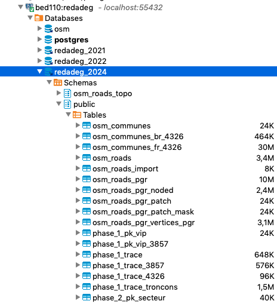

# Connexion directe à la base de données

## Principe

Il est possible de se connecter en direct sur le serveur PostgreSQL au travers d'un tunnel SSH.

Le principe est de rediriger les connections locales sur un port 55432 vers le port 5432 de la machine bed110.bedniverel.bzh.

Le port 5432 est le port d'écoute par défaut de PostgreSQL.

## Création du tunnel SSH

`ssh -L 55432:bed110.bedniverel.bzh:5432 user@bed110.bedniverel.bzh`

## Création d'une connexion dans DBeaver

Télécharger puis installer [DBeaver](https://dbeaver.io/).

Créer une nouvelle connexion avec comme informations :

* host = `localhost`
* port = `55432`
* database = `postgres` (connexion à une base de données par défaut)
* utilisateur = `redadeg` + le mot de passe

Pour un usage expert / voir les géométries, il faut installer les pilotes `postgis-jdbc` et `postgis-geometry` au pilote PostgreSQL dans le gestionnaire de pilotes.

