# Patch manuel du filaire de voies

## Principe

À cause de la configuration des données à certains endroits ou à cause des boucles en centre-ville il est nécessaire de "patcher" le filaire routable brut avec un filaire de voies créé spécialement pour cet endroit.


## Préliminaires


* ouvrir un tunnel SSH avec [ce script](https://github.com/osm-bzh/ar_redadeg/tree/master/ssh/bed110_tunnel_pg.sh) pour pouvoir accéder directement à la base de données PostGIS. Attention : SSH = lent.
* vérifier que le réseau routier OSM est relativement récent avant de commencer. Ceci pour prendre en compte les dernières modifications du réseau routier de OpenStreetMap. Si la base OSM est trop ancienne : la mettre à jour avec [ce script](maj_donnees_osm.md).
* refaire tourner le script phase 1 sur le secteur concerné par le patch. On va obtenir un nouveau filaire de voies le long du tracé manuel.


## Créer un patch

### Organisation / gestion

* ouvrir le projet QGIS de gestion / contrôle des données `redadeg 2024 patch OSM roads.qgz`
* ouvrir le tableau de bord de suivi des patches pour savoir où il faut en gérer
* dans le tableau de bord : choisir une zone à patcher
* ouvrir le lien umap pour comprendre / trouver le lieu
* déplacer la carte à ce lieu dans le projet QGIS


### Créer un filaire de voies optimisé

* afficher les couches `phase_1_trace` et `osm_roads.the_geom`

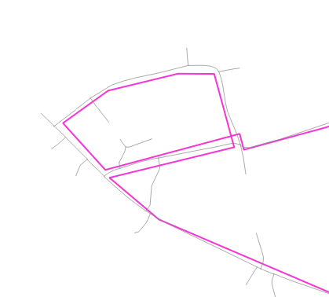

* sélectionner la couche `osm_roads.the_geom` dans la liste des couches
* changer l'outil de sélection pour pouvoir sélectionner par polygone

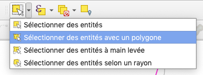

* tracer un polygone le plus ajusté possible à la zone à patcher **mais en prenant un tronçon de marge avant et après la zone !**

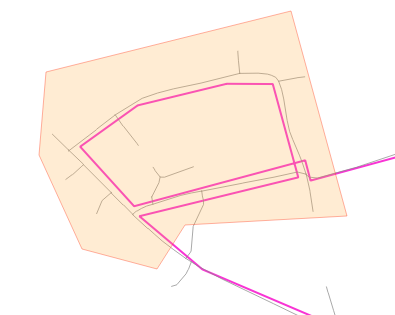

* on obtient une sélection de tronçons
* copier les entités (ctrl + c)
* ouvrir une session d'édition sur la couche `osm_roads_pgr_patch` : sélectionner cette couche et cliquer sur le bouton en forme de crayon
* coller les entités (ctrl + v)
* enregistrer tout de suite les modifications de la couche
* désélectionner

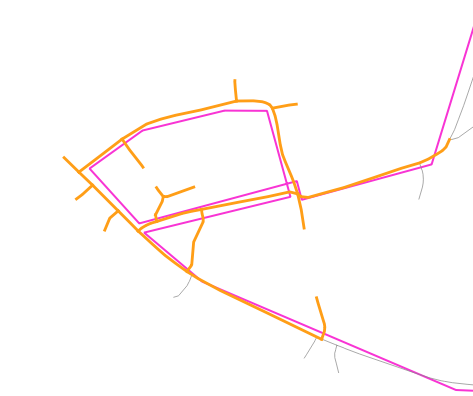

* repérer le cheminement du tracé et désafficher la couche `phase_1_trace`
* optionnel mais plus propre : supprimer tous les tronçons pendants / inutiles et surtout ceux qui permettraient un itinéraire plus court

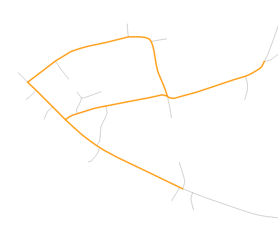


* il s'agit ensuite de dupliquer un ou plusieurs tronçons afin de créer une route en parallèle à l'endroit où on doit gérer une boucle / un croisement. 
* dans l'exemple ci-dessous on laisse passer le parcours sur le filaire original et on crée une route parallèle pour le deuxième passage. **Retenir qu'il faut surtout faire en sorte de ne pas avoir de nœuds du réseau à ces endroits de croisement.** Appuyer sur la touche echapp du clavier pour désactiver une capture de nœud.

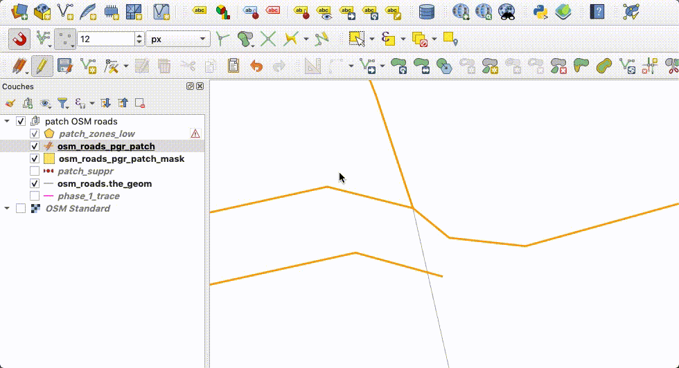

* autre exemple de gestion d'un croisement : on ajuste simplement les nœuds / sommets.
* on a sélectionné un sommet avec l'outil d'édition de sommet et cliquer sur la touche suppr du clavier pour le supprimer. Le reste est du recalage avec la fonction de capture activée.

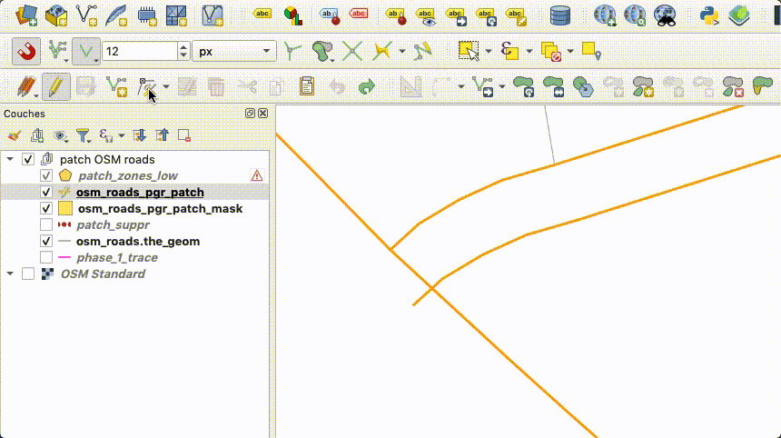

* Enregistrer les modifications
* Fermer la session d'édition (sauf si vous êtes à l'aise dans QGIS).


### Créer une zone de patch

Pour qu'un patch soit actif, il faut créer un polygone qui correspond à la zone à patcher.

* ouvrir une session d'édition et dessiner une zone d'emprise dans la couche `osm_roads_pgr_patch_mask`
* cette zone doit correspondre à peu près au polygone de sélection des tronçons qui a été fait au tout début
* à la fin : saisir le nom du lieu et l'id du secteur

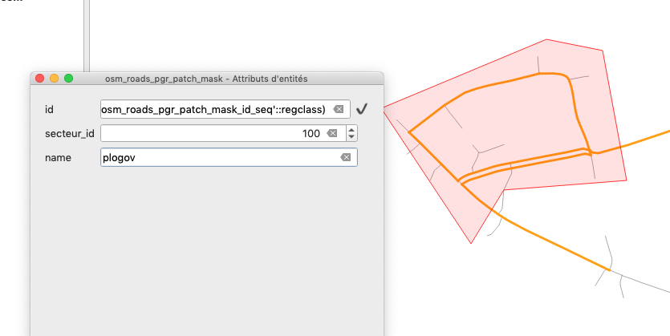

* Enregistrer
* Fermer la session d'édition (sauf si vous êtes à l'aise dans QGIS).


## Tester le patch et le routage

Lancer le traitement phase 2. Exemple : `python update_secteur.py 2024 100 phase_2`

Exemple de sortie où l'on voit que 0 km d'itinéraire ont été calculés. Cela veut dire qu'il y a un problème entre le PK de secteur de début et de fin.

```
 Calcul d'un l'itinéraire pour le secteur 100 pour le millésime 2024

 Lecture du fichier de configuration 

  Connexion à la base redadeg_2024 sur localhost réussie 

  vidage de la couche de routage pour le secteur 100
  fait
  Recherche du node_id du PK de début et du node_id du PK de fin
  fait
  calcul d'un itinéraire entre les nœuds 7943 et 4880
  fait : 0.0 km calculés pour le secteur 100

  Fermeture de la connexion à la base redadeg_2024 sur localhost
```

Ci-dessous la procédure pour calculer manuellement un itinéraire entre 2 nœuds du réseau routier.

* dans la sortie d'exécution du script repérer l'identifiant du nœud de début. Ici `17641`.
* activer la visibilité de la couche `osm_roads_pgr_vertices`.
* repérer l'identifiant d'un nœud situé après la couche de patch. Exemple ici : `17717`

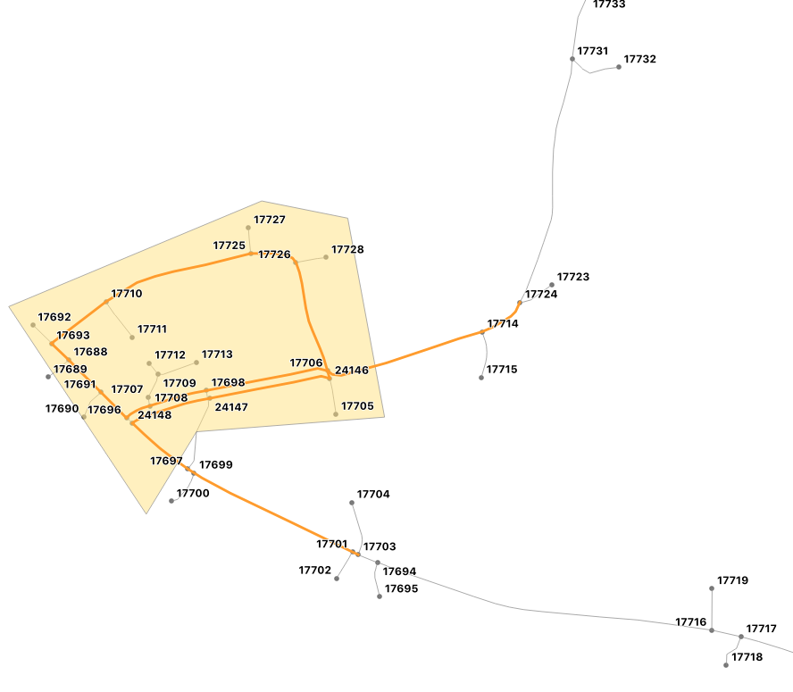

* activer la visibilité de la couche `test routage`
* clic-droit sur cette couche > Mettre à jour la couche SQL
* Modifier l'avant-dernière ligne de la requête SQL et remplacer les id des sommets de départ et arrivée. Exemple : `'SELECT id, source, target, cost, reverse_cost FROM osm_roads_pgr', 17641, 17717) as a`
* cliquer sur 'Exécuter' puis 'Mettre à jour la couche' puis 'Close'
* on voit le résultat du calcul d'itinéraire et la prise en compte de la zone de patch

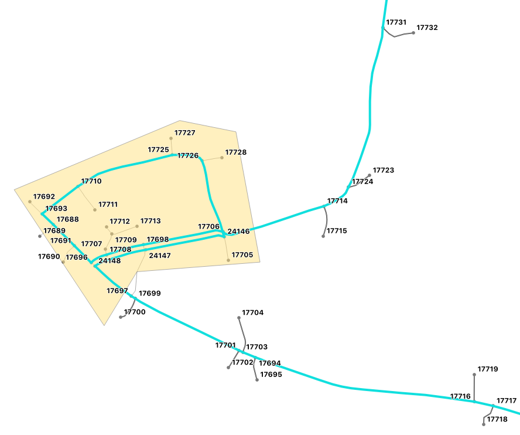


## Que faire quand le calcul d'itinéraire ne se fait pas ?

Le traitement phase 2 ne parvient pas à créer un itinéraire ?
Il y a très certainement une interruption du réseau filaire quelque part.

Pour le trouver : soit on suit le tracé phase 1 avec la couche `osm_roads_pgr` affichée soit on lance un calcul d'itinéraire manuel (voir ci-dessus) entre le début du secteur puis de loin en loin jusqu'à trouver l'endroit qui pose problème. Dans l'exemple ci-dessous on constate que la saisie du tracé phase 1 manuel s'est fait trop loin de la route.

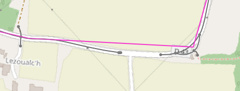
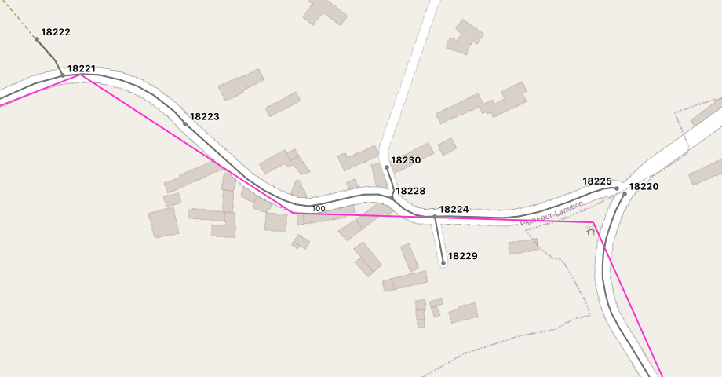